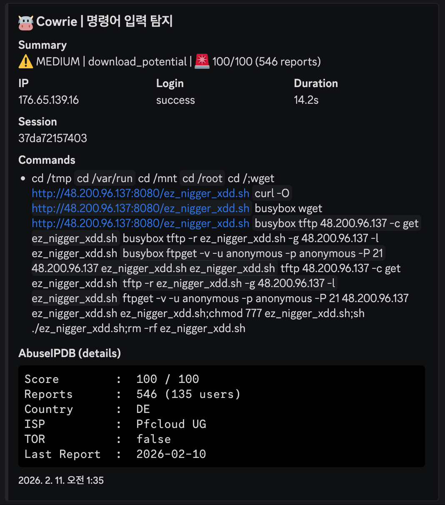

# 🛡️ Attack Analysis: Multi-Tool Persistent Payload Delivery

## 1. 개요 (Executive Summary)
본 분석은 가용한 모든 시스템 유틸리티(`tftp`, `ftpget`, `busybox` 등)를 동원하여 악성 페이로드를 강제로 주입하려는 집요한 공격 패턴을 다룹니다. 특정 도구가 차단된 환경에서도 다운로드에 성공하기 위해 폴백(Fallback) 메커니즘을 자동화한 것이 특징입니다.

- **분석 일시:** 2026-02-16
- **공격자 IP:** `176.65.139.16` (Pfcloud UG / Germany)
- **위협 수준:** Critical (AbuseIPDB Score: 100/100, 546 reports)
- **타겟 서비스:** SSH / Telnet (IoT & Embedded Systems 타겟)

---

## 2. TTP 분석 (MITRE ATT&CK Matrix)

| 전술 (Tactics) | 기법 ID | 기법명 (Technique) | 상세 행위 |
|:---|:---|:---|:---|
| **Execution** | T1059.004 | Unix Shell | 다중 다운로드 도구를 결합한 복합 스크립트 실행 |
| **Persistence** | T1105 | Ingress Tool Transfer | `wget`, `curl`, `tftp`, `ftp`를 동원한 페이로드 반입 |
| **Defense Evasion** | T1070.004 | File Deletion | 실행 직후 `rm -rf`를 통한 원본 파일 삭제 |

---

## 3. IoC (Indicators of Compromise)

| 유형 | 값 (Value) | 비고 |
|:---|:---|:---|
| **IPv4** | `176.65.139.16` | 공격 진원지 (상습 공격 IP) |
| **URL** | `http://48.200.96.137:8080/ez_nigger_xdd.sh` | 페이로드 배포 서버 (포트 8080 사용) |
| **File Name** | `ez_nigger_xdd.sh` | 최종 단계 페이로드 |
| **Tool List** | `tftp`, `ftpget`, `busybox` | 페이로드 반입에 사용된 도구들 |

---

## 4. 공격 타임라인 및 분석 (Attack Lifecycle)

공격자는 약 14초 동안 시스템의 가용 도구를 전수 조사하며 침투를 시도했습니다.

| 시간 (KST) | 명령어 (Input) | 분석 및 의도 |
|:---|:---|:---|
| 01:35:01 | `cd /tmp || cd /var/run ...` | 쓰기 가능한 디렉토리를 순차적으로 탐색 |
| 01:35:05 | `wget`, `curl -O`, `busybox wget` | 일반적인 HTTP 기반 다운로드 시도 |
| 01:35:10 | `tftp -r ... -g`, `ftpget -v ...` | **Persistence:** HTTP 차단 시 UDP(TFTP) 또는 FTP를 통한 우회 반입 시도 |
| 01:35:12 | `chmod 777 ...; sh ./...` | 권한 부여 및 페이로드 실행 |
| 01:35:14 | `rm -rf ez_nigger_xdd.sh` | 분석 방해를 위한 페이로드 즉시 삭제 |

### 실제 탐지 화면 (Cowrie Dashboard)

> **비고:** AbuseIPDB 리포트가 500건 이상 누적된 매우 위험한 IP로, 일반적인 리눅스 서버뿐만 아니라 보안이 취약한 IoT 장비를 주요 타겟으로 삼고 있습니다.

---

## 5. 탐지 전략 (Detection Strategy)

본 사례는 도구의 종류를 가리지 않는 집요한 반입 시도를 특징으로 하며, 이를 효과적으로 차단하기 위해 **계층형 탐지(Layered Detection)** 모델을 적용합니다.

### A. 표준 이벤트 탐지 (Standard/Atomic Detection)
공격자가 동원하는 다양한 침투 도구와 실행 기법을 개별적으로 식별합니다.

* **다중 경로 진입 탐지 ([`lnx-susp-writable-paths.yml`](../../sigma_rules/standard/lnx-susp-writable-paths.yml))**: `/tmp`, `/var/run` 등 쓰기 권한이 확보된 모든 디렉토리를 순회하며 침투 지점을 찾는 행위를 포착합니다.
* **멀티 툴 다운로드 탐지 ([`lnx-susp-download-tools.yml`](../../sigma_rules/standard/lnx-susp-download-tools.yml))**: `wget`, `curl` 뿐만 아니라 HTTP 우회를 위해 사용된 `tftp`, `ftpget`, `busybox` 등의 도구 활용 시도를 전수 식별합니다.
* **실행 및 클린업 탐지 ([`lnx-susp-exec-cleanup.yml`](../../sigma_rules/standard/lnx-susp-exec-cleanup.yml))**: 페이로드에 `chmod 777` 권한을 부여하고 실행한 뒤, 증거 인멸을 위해 `rm -rf`로 즉시 삭제하는 행위를 통합 탐지합니다.

---

### B. 상관관계 분석 (Correlation/Behavioral Detection)
개별 도구 사용을 넘어, 봇넷의 전형적인 '물량 공세'식 감염 시나리오를 확정적으로 식별합니다.

* **파일명**: [`corr-lnx-classic-dropper.yml`](../../sigma_rules/correlation/corr-lnx-classic-dropper.yml)
* **탐지 로직**: 
    1. 동일 세션 내에서 **경로 진입**(`lnx-susp-writable-paths`) 징후 포착
    2. 5분(Timespan) 이내에 **2종 이상의 복합 도구**(`lnx-susp-download-tools`)가 순차적으로 호출되는 행위 확인
    3. 최종적으로 **권한 상승 및 실행/삭제**(`lnx-susp-exec-cleanup`)가 완료되는 시퀀스를 포착할 때 `Critical` 알람 생성
* **효과**: 특정 도구 차단만으로는 막기 힘든 지능형 봇넷의 '샷건(Shotgun)' 방식 침투를 전체적인 행위 흐름을 통해 완벽하게 방어합니다.

---

## 6. 대응 권고 사항 (Mitigation)
* **도구 제한:** 서버 운영에 불필요한 `tftp`, `ftp` 클라이언트 삭제 또는 실행 권한 제한.
* **포트 차단:** 비표준 포트(8080) 및 TFTP(69) 관련 아웃바운드 트래픽 모니터링 강화.
* **파일 무결성:** `/tmp` 등 임시 폴더 내의 실행 파일 생성을 실시간으로 감시하는 EDR/SIEM 룰 적용.

---
**Authored by**: [@BISHOP1027](https://github.com/BISHOP1027)