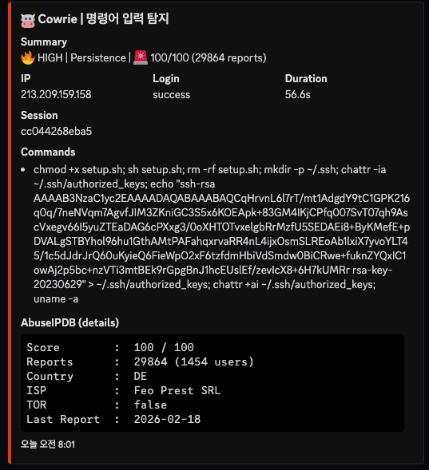

# 🛡️ Attack Analysis: SSH Persistence via Authorized_Keys Locking

## 1. 개요 (Executive Summary)
본 분석은 Cowrie 허니팟에서 수집된 **지속성 확보(Persistence)** 및 **방어 회피(Defense Evasion)** 공격 시나리오를 다룹니다. 공격자는 침투 성공 후 흔적을 제거하고, 악성 SSH 공개키를 주입한 뒤, 관리자가 이를 수정하거나 삭제할 수 없도록 파일을 잠그는 전형적인 **Post-Exploitation** 패턴을 보였습니다.

- **분석 일시:** 2026-02-19
- **공격자 IP:** `213.209.159.158` (독일, Host Europe GmbH)
- **위협 수준:** **Critical** (Active Backdoor)
- **타겟 서비스:** SSH (Cowrie Honeypot)

## 2. TTP 분석 (MITRE ATT&CK Matrix)
공격자의 행위를 MITRE ATT&CK 프레임워크에 기반하여 분류한 결과입니다.

| 전술 (Tactics) | 기법 ID | 기법명 (Technique) | 상세 행위 |
|:---|:---|:---|:---|
| **Execution** | T1059.004 | Unix Shell | `sh setup.sh`를 통한 악성 스크립트 실행 |
| **Persistence** | T1098.004 | SSH Authorized Keys | `authorized_keys` 파일 내 공격자 공개키 주입 |
| **Defense Evasion** | T1070.004 | File Deletion | `rm -rf setup.sh`로 침투 흔적 제거 |
| **Defense Evasion** | T1564.004 | File Attribute Modification | `chattr +ai`로 백도어 파일 잠금 및 수정 방지 |

## 3. IoC (Indicators of Compromise)
본 공격 행위와 관련된 주요 위협 지표입니다.

| 유형 | 값 (Value) | 비고 |
|:---|:---|:---|
| **IPv4** | `213.209.159.158` | SSH Brute-force 및 백도어 배포 IP |
| **File Path** | `~/.ssh/authorized_keys` | 지속성 확보 타겟 파일 |
| **Command** | `chattr +ai` / `chattr -ia` | 파일 불변(Immutable) 속성 강제 변조 시그니처 |
| **Key Comment** | `rsa-key-20230629` | 공격에 사용된 특정 공개키 식별자 |

## 4. 공격 타임라인 및 분석 (Attack Lifecycle)

본 분석은 허니팟에서 추출된 원본 로그 데이터인 [`sample.json`](./sample.json)을 기반으로 수행되었습니다. 공격자는 세션 연결 후 자동화된 스크립트를 통해 단 3초 내에 시스템 장악을 시도했으며, 단일 로그 라인에 세미콜론(`;`)으로 연결된 복합 명령어를 실행했습니다.

### 원본 데이터 프로파일링 (from sample.json)
* **공격 소스 IP:** `213.209.159.158` (독일 소재)
* **세션 식별자:** `cc044268eba5`
* **로그 타임스탬프:** `2026-02-18T23:01:25.756Z`
* **이벤트 유형:** `cowrie.command.input`

### 단계별 명령어 실행 의도

| 시간 (UTC) | 명령어 (Input) | 분석 및 의도 |
|:---|:---|:---|
| 23:01:25 | `chmod +x setup.sh; sh setup.sh; rm -rf setup.sh` | 페이로드 실행 권한 부여 및 실행 후 즉시 원본 삭제 (**Defense Evasion**) |
| 23:01:26 | `mkdir -p ~/.ssh; chattr -ia ~/.ssh/authorized_keys` | SSH 폴더 생성 및 파일 보호 속성 해제하여 수정 권한 확보 (**Persistence**) |
| 23:01:26 | `echo "ssh-rsa ... rsa-key-20230629" > authorized_keys` | 공격자의 백도어 공개키를 시스템에 직접 주입 (**Persistence**) |
| 23:01:27 | `chattr +ai ~/.ssh/authorized_keys` | 파일을 '추가/삭제 불가' 상태로 재잠금하여 영구적 백도어 고착화 (**Defense Evasion**) |
| 23:01:28 | `uname -a` | 시스템 정보 확인을 통한 공격 성공 여부 최종 판별 (**Discovery**) |

### 실제 탐지 화면 (Cowrie Dashboard)

> **데이터 신뢰성 검증:** sample.json의 고유 UUID와 센서 ID를 통해 본 공격이 분산된 허니팟 노드 중 특정 지점에서 발생한 실측 데이터임을 확인했습니다. 특히 소스 IP(213.209.159.158)는 AbuseIPDB에서 100/100 위험도를 기록한 전력이 있어, 본 시나리오가 실제 위협 그룹의 자동화된 공격 시퀀스임을 뒷받침합니다.

## 5. 탐지 전략 (Detection Strategy)

본 사례는 공격의 전 과정을 단계별로 식별하고 이를 논리적으로 결합하는 **계층형 탐지(Layered Detection)** 모델을 적용합니다.

### A. 표준 이벤트 탐지 (Standard/Atomic Detection)
공격 시퀀스의 각 구성 요소를 개별적으로 식별하여 가시성을 확보합니다.

* **흔적 제거 탐지 ([`lnx-susp-exec-cleanup.yml`](../../sigma_rules/standard/lnx-susp-exec-cleanup.yml))**: 실행 직후 파일을 삭제하는 전형적인 드로퍼 패턴을 포착합니다.
* **키 주입 탐지 ([`lnx-persist-ssh-key-auth.yml`](../../sigma_rules/standard/lnx-persist-ssh-key-auth.yml))**: `authorized_keys` 파일에 대한 직접적인 데이터 쓰기 행위를 식별합니다.
* **속성 변조 탐지 ([`lnx-persist-attr-immutable.yml`](../../sigma_rules/standard/lnx-persist-attr-immutable.yml))**: `chattr`를 이용한 파일 잠금 시도를 정규표현식(`chattr\s+[-+]+[ia]+`)으로 포착합니다.

---

### B. 상관관계 분석 (Correlation/Behavioral Detection)
개별 이벤트들을 묶어 공격자의 최종 의도인 '영구적 백도어 고착화'를 확정적으로 식별합니다.

* **파일명**: [`corr-lnx-persist-ssh-lock`](../../sigma_rules/correlation/corr-lnx-persist-ssh-lock.yml)
* **탐지 로직**: 
    1. 동일 세션 내에서 **흔적 제거**, **키 주입**, **속성 변조** 이벤트가 순차적으로 발생
    2. 5분(Timespan) 이내에 위 행위들이 집중될 경우 **Critical** 알람 발생
* **효과**: 관리자의 정상적인 키 교체 작업(단발성 `echo` 사용)과 공격자의 자동화된 '열기-심기-잠그기' 시퀀스를 명확히 구분하여 정교한 침해 지표를 제공합니다.

---

## 6. 대응 권고 사항 (Mitigation)

공격자가 시스템에 영구적인 백도어를 설치하는 것을 방지하고, 침투 시 즉각 대응하기 위한 권고 사항입니다.

### A. 시스템 및 파일 보안 강화
* **불변 속성(Immutable) 모니터링:** 관리자가 의도하지 않은 `chattr +i` 또는 `+a` 설정 변경을 실시간 감시하고, `/usr/bin/chattr` 실행 권한을 특정 관리자 그룹으로 제한합니다.
* **SSH 디렉토리 보호:** `~/.ssh` 폴더 및 `authorized_keys` 파일에 대한 무결성 검사를 주기적으로 수행하며, 비인가된 키 주입 시 즉각 알람을 발생시키는 EDR/HIDS 정책을 적용합니다.
* **임시 디렉토리 실행 제한:** `/tmp`, `/var/tmp` 등 공격자가 드로퍼를 실행하는 경로에 `noexec` 옵션을 마운트하여 악성 스크립트의 실행을 원천 차단합니다.

### B. SSH 서비스 설정 최적화 (Hardening)
* **키 기반 인증 강화:** 불필요한 패스워드 인증을 비활성화(`PasswordAuthentication no`)하고, 반드시 신뢰된 관리자 IP에서만 SSH 접속이 가능하도록 ACL(Access Control List)을 설정합니다.
* **중앙 집중형 키 관리:** 개별 서버의 `authorized_keys` 파일에 의존하지 않고, LDAP이나 중앙 집중식 SSH 키 관리 솔루션을 사용하여 키의 생성 및 삭제를 통제합니다.

### C. 탐지 및 대응 자동화 (SOAR 연동)
* **자동 격리 파이프라인:** 위에서 정의한 `Critical` 등급의 Correlation 룰 탐지 시, 관련 세션을 즉시 차단하고 해당 IP를 방화벽 블랙리스트에 자동 등록하는 SOAR 플레이북을 운영합니다.
* **로그 통합 분석:** Cowrie와 같은 허니팟 로그뿐만 아니라 커널 로그(Auditd), 인증 로그(`/var/log/auth.log`)를 통합 분석하여 `chattr`와 같은 시스템 바이너리 오남용을 전수 조사합니다.

---
**Authored by**: [@BISHOP1027](https://github.com/BISHOP1027)